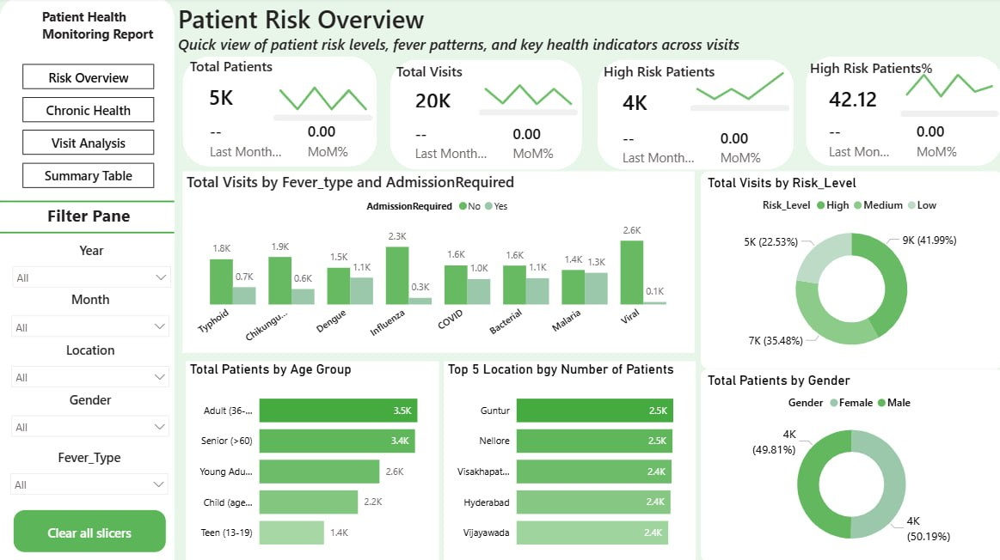
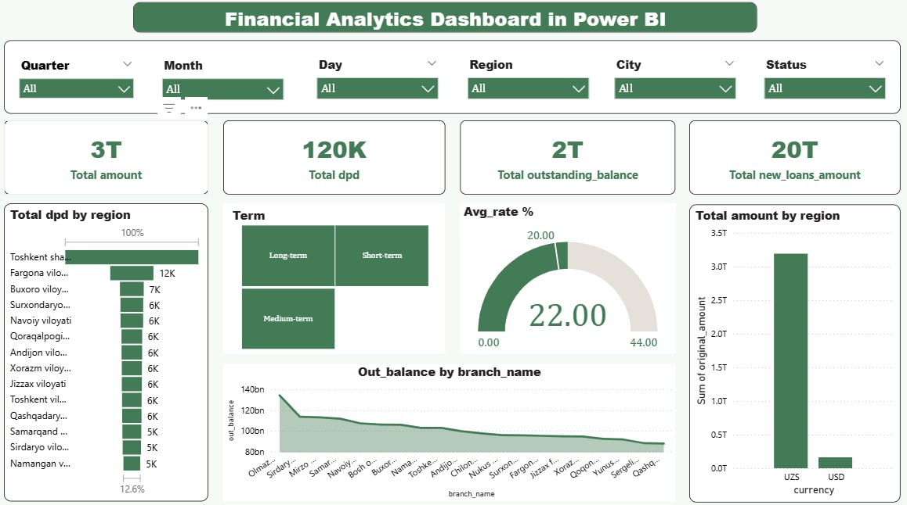
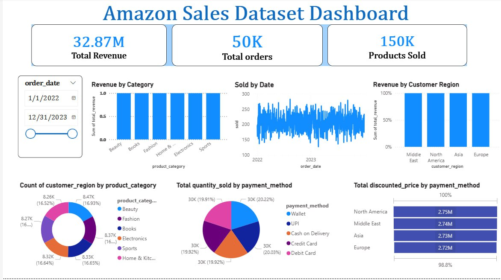
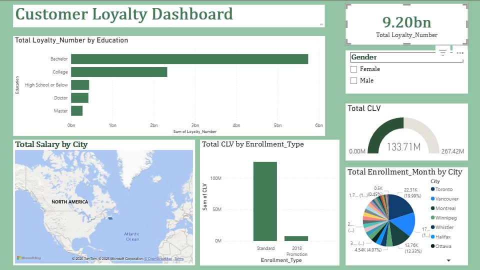

# Business Dashboard — Power BI

## Overview
Collection of interactive Power BI dashboards analyzing healthcare, finance, sales, and customer loyalty data.

## Tools & Technologies
- Microsoft Power BI
- DAX (Data Analysis Expressions)
- Excel / CSV data sources

## Dashboards

### 1. Patient Health Monitoring Report

- KPI cards: Total Patients, Total Visits, High Risk Patients
- Fever type analysis, Age group breakdown, Regional distribution

### 2. Financial Analytics Dashboard

- Portfolio and risk analysis for Uzbekistan regions
- NPL ratio trends, loan distribution by channel and client type

### 3. Amazon Sales Dashboard

- Total Revenue: $32.87M | Orders: 50K | Products Sold: 150K
- Revenue by category, region, and payment method

### 4. Portfel va Risk Tahlili

- Outstanding balance, repayment trends, NPL ratio monitoring

## Skills Demonstrated
Power BI · DAX · Data Visualization · Dashboard Design · Business Reporting
